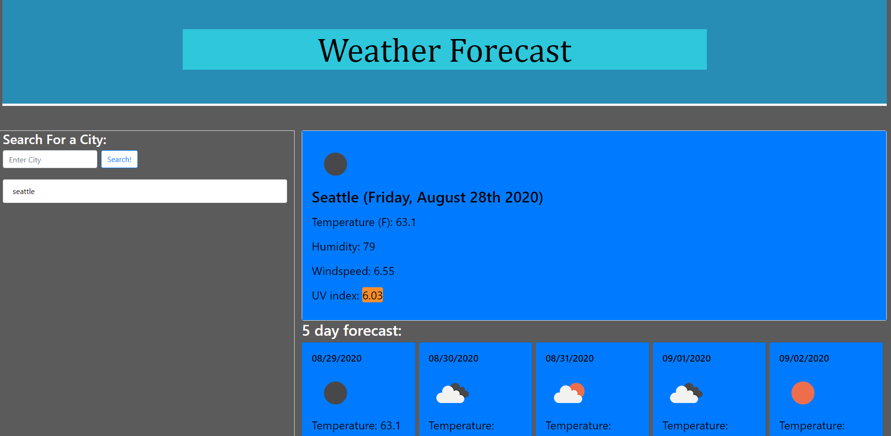

# hows-the-weather

The hows-the-weather application is an application that uses HTML, CSS, JS, JQuery, Bootstrap, Moment.JS and two of the OpenWeather APIs.
By combining all of them together we get a dynamic, weather dashboard that lists the current weather information for a certain city. Not only that but it also shows the weather for the next 5 days. In addition to that it will give you a color depending on the level of severity for the UV index. The weather dashboard also saves your searches, and are able to click on them to return to that weather data. The latest search will appear on the list when the page is loaded again. Possible future changes, are making it compatible with a raspberry pi.

## Pre-view

https://rxjas.github.io/hows-the-weather/

### APIs 

* https://openweathermap.org/api/one-call-api

* https://openweathermap.org/forecast5

#### Resources 
 
* https://oscarotero.com/jquery/

* https://jquery.com/

* https://stackoverflow.com/questions/6658752/click-event-doesnt-work-on-dynamically-generated-elements

* https://momentjs.com/docs/#/parsing/string-format/

* https://getbootstrap.com/

* https://developer.mozilla.org/en-US/docs/Web/API/Window/localStorage#:~:text=The%20read%2Donly%20localStorage%20property,is%20saved%20across%20browser%20sessions.
